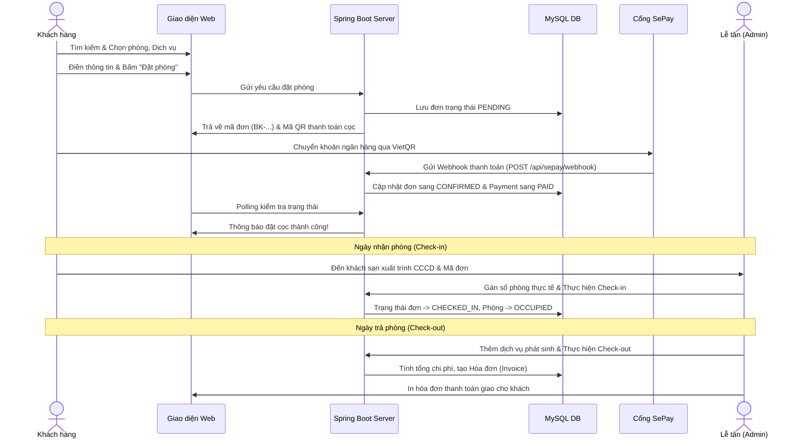

# 🏨 Hotel Management System (Spring Boot)

<p align="center">
  
</p>

<p align="center">
  <strong>Hệ thống quản lý khách sạn và đặt phòng trực tuyến hiện đại, toàn diện được xây dựng trên nền tảng Java Spring Boot, MySQL và Thymeleaf.</strong>
</p>

<p align="center">
  
  
  
  
  
  
  
</p>

---

## 📖 Giới thiệu dự án

**Hotel Management System** là giải pháp phần mềm quản trị khách sạn tích hợp cổng thông tin đặt phòng trực tuyến dành cho khách hàng. Hệ thống đáp ứng đầy đủ nghiệp vụ quản lý phòng, vận hành lễ tân (check-in / check-out), thanh toán tự động qua mã QR ngân hàng (SePay), quản lý dịch vụ gia tăng, xuất in hóa đơn tiêu chuẩn và báo cáo thống kê doanh thu theo thời gian thực.

Dự án được thiết kế theo kiến trúc phân tầng chuẩn mực MVC (**Model - View - Controller**), đảm bảo khả năng mở rộng linh hoạt, bảo mật cao với **Spring Security** và giao diện người dùng thân thiện, tối ưu trải nghiệm trên mọi thiết bị.

---

## ✨ Tính năng nổi bật

### 1. 🌐 Phân hệ Khách hàng (Client Portal)
- **Trang chủ & Khám phá:** Banner trình diễn, giới thiệu dịch vụ, danh sách hạng phòng nổi bật và đánh giá khách hàng.
- **Tìm kiếm & Lọc phòng:** Tìm kiếm phòng trống theo thời gian check-in / check-out, số lượng khách và lọc theo tiện ích.
- **Chi tiết phòng:** Xem thông tin mô tả chi tiết, hình ảnh chất lượng cao, các tiện nghi đi kèm và giá phòng niêm yết.
- **Đặt phòng trực tuyến (Online Booking):** Đặt phòng linh hoạt, chọn thêm dịch vụ đi kèm (buffet sáng, đưa đón sân bay, spa,...), áp dụng mã giảm giá voucher.
- **Thanh toán tự động với VietQR / SePay:**
  - Hiển thị mã QR ngân hàng động kèm mã đơn `BK-XXXXXXXX-XXXX`.
  - Tự động nhận diện thanh toán cọc qua Webhook SePay và xác nhận đơn (`CONFIRMED`) tức thì mà không cần nhân viên duyệt thủ công.
  - Hỗ trợ cơ chế Polling Real-time để cập nhật trạng thái đơn ngay trên trình duyệt của khách hàng.
- **Quản lý tài khoản cá nhân:** Đăng ký, đăng nhập, đổi mật khẩu, xem hồ sơ cá nhân và theo dõi lịch sử các chuyến đi (`My Bookings`).
- **Đánh giá & Phản hồi:** Gửi phản hồi, chấm điểm sao cho các đơn phòng đã hoàn thành.

---

### 2. ⚙️ Phân hệ Quản trị & Vận hành Lễ tân (Admin & Receptionist)
- **Bảng điều khiển (Dashboard):** Thống kê số lượng phòng, tỷ lệ lấp đầy, lượt booking mới trong ngày, doanh thu thực tế và danh sách phòng cần dọn dẹp.
- **Sơ đồ phòng trực quan (Room Matrix):** Giám sát trạng thái phòng theo tầng (Trống, Đã đặt, Đang ở, Đang dọn dẹp, Bảo trì).
- **Vận hành Đặt phòng & Lễ tân:**
  - Tạo đơn đặt phòng trực tiếp tại quầy (Walk-in booking).
  - Tiếp nhận, xử lý đơn: Duyệt cọc, thực hiện thủ tục **Check-in** (gán phòng thực tế) và **Check-out**.
  - Ghi nhận và quản lý các dịch vụ phát sinh của khách trong suốt kỳ nghỉ.
- **Quản lý Hạng phòng & Phòng:**
  - Thêm, sửa, xóa hạng phòng, cấu hình sức chứa, giá gốc, tiện ích.
  - Tải ảnh đại diện và bộ sưu tập ảnh trực tiếp lên đám mây **Cloudinary**.
  - Quản lý danh mục phòng cụ thể, số phòng, phân bố tầng lầu.
- **Quản lý Tiện ích (Amenities):** Danh mục tiện nghi phòng kèm thư viện biểu tự (Icon picker).
- **Quản lý Dịch vụ (Services):** Quản lý bảng giá các dịch vụ khách sạn (Nhà hàng, Spa, Giặt ủi, Tour ngắm san hô, Thuê xe máy,...).
- **Quản lý Khuyến mãi (Promotions):** Thiết lập các chương trình ưu đãi, mã giảm giá theo tỷ lệ `%` hoặc số tiền cố định, giới hạn thời gian áp dụng.
- **Quản lý Khách hàng (Customers):** Lưu trữ hồ sơ định danh (CCCD/Hộ chiếu), số điện thoại, email và lịch sử lưu trú.
- **Thanh toán & Hóa đơn (Invoices):**
  - Tự động tổng hợp chi phí phòng, dịch vụ, khấu trừ khuyến mãi và tiền cọc.
  - Hỗ trợ xem chi tiết và **in hóa đơn thanh toán chuẩn A4** chuyên nghiệp.
- **Báo cáo Doanh thu (Revenue Analytics):** Báo cáo thống kê tài chính theo ngày, tuần, tháng và phân tích cơ cấu doanh thu (tiền phòng / dịch vụ).
- **Quản lý Người dùng & Phân quyền:** Quản lý tài khoản nhân sự với hệ thống vai trò chuẩn: `ADMIN`, `MANAGER`, `RECEPTIONIST`, `CUSTOMER`.

---

## 🛠️ Công nghệ sử dụng (Tech Stack)

| Thành phần | Công nghệ / Thư viện |
| :--- | :--- |
| **Ngôn ngữ** | Java 17 (LTS) |
| **Framework chính** | Spring Boot 4.0.8 / Spring MVC |
| **Bảo mật** | Spring Security 6 (BCrypt Password Encoder, Role-based Access Control) |
| **ORM / Data Access** | Spring Data JPA, Hibernate |
| **Cơ sở dữ liệu** | MySQL 8.0+ |
| **Template Engine** | Thymeleaf, Thymeleaf Layout Dialect, Thymeleaf Extras Spring Security |
| **Lưu trữ hình ảnh** | Cloudinary Java SDK (v1.36.0) |
| **Cổng thanh toán** | SePay Webhook (Tự động khớp lệnh chuyển khoản ngân hàng) |
| **Frontend** | HTML5, CSS3 (Modular styles), Vanilla JavaScript |
| **Build & Dependency Tool** | Apache Maven |
| **Tiện ích mã nguồn** | Project Lombok |

---

## 📁 Cấu trúc thư mục dự án

```text
hotel-management/
├── src/
│   ├── main/
│   │   ├── java/com/hotel/hotelmanagement/
│   │   │   ├── config/                     # Cấu hình Spring Security, Cloudinary, DataInitializer
│   │   │   ├── controller/
│   │   │   │   ├── admin/                  # Controllers quản trị (Dashboard, Room, Booking, Invoice,...)
│   │   │   │   ├── client/                 # Controllers giao diện khách hàng (Home, Room, Booking,...)
│   │   │   │   ├── payment/                # Xử lý Webhook SePay & API kiểm tra trạng thái thanh toán
│   │   │   │   ├── AuthController.java     # Đăng ký, đăng nhập, quên mật khẩu
│   │   │   │   └── GlobalControllerAdvice.java
│   │   │   ├── dto/                        # Data Transfer Objects
│   │   │   ├── entity/                     # Các JPA Entities (User, Role, Room, Booking, Invoice,...)
│   │   │   ├── repository/                 # Spring Data JPA Repositories
│   │   │   ├── service/                    # Business Logic Interfaces & Implements
│   │   │   └── HotelManagementApplication.java
│   │   └── resources/
│   │       ├── static/                     # Tài nguyên tĩnh
│   │       │   ├── css/                    # Modular CSS cho Admin, Client, Auth
│   │       │   ├── js/                     # Modular JavaScript
│   │       │   └── images/                 # Hình ảnh minh họa, banner, icon
│   │       ├── templates/                  # Giao diện Thymeleaf
│   │       │   ├── admin/                  # Trang quản trị (dashboard, room, booking, invoice,...)
│   │       │   ├── auth/                   # Trang đăng nhập, đăng ký, 403
│   │       │   ├── client/                 # Giao diện khách hàng (home, rooms, checkout,...)
│   │       │   └── layout/                 # Layout dùng chung (admin-layout, client-layout)
│   │       └── application.properties      # Cấu hình Database, Cloudinary, Server Port
│   └── test/                               # Unit & Integration Tests
├── hotel_mangement.sql                     # Script khởi tạo cơ sở dữ liệu MySQL
├── pom.xml                                 # Cấu hình dependencies Maven
└── README.md
```

---

## 🚀 Hướng dẫn cài đặt & Khởi chạy

### 1. Yêu cầu môi trường
- **Java Development Kit (JDK):** Phiên bản 17 trở lên
- **MySQL Server:** Phiên bản 8.0 trở lên
- **Maven:** 3.8+ (hoặc dùng `mvnw` đi kèm dự án)
- **Git**

---

### 2. Các bước triển khai

#### Bước 1: Clone kho mã nguồn về máy
```bash
git clone https://github.com/NgoxCuong/hotel-management-springboot.git
cd hotel-management-springboot
```

#### Bước 2: Thiết lập Cơ sở dữ liệu MySQL
1. Mở MySQL Workbench hoặc Terminal và tạo cơ sở dữ liệu:
```sql
CREATE DATABASE hotel_management CHARACTER SET utf8mb4 COLLATE utf8mb4_unicode_ci;
```

2. (Tùy chọn) Nhập cấu trúc bảng từ file script `hotel_mangement.sql`:
```bash
mysql -u root -p hotel_management < hotel_mangement.sql
```
*(Nếu bỏ qua bước này, Spring Data JPA với `ddl-auto=update` cũng sẽ tự động tạo bảng khi khởi chạy).*

#### Bước 3: Cấu hình `application.properties`
Mở file `src/main/resources/application.properties` và chỉnh sửa các thông số phù hợp với môi trường của bạn:

```properties
# Cấu hình Port
server.port=8080

# Cấu hình kết nối MySQL
spring.datasource.url=jdbc:mysql://localhost:3306/hotel_management?useSSL=false&serverTimezone=Asia/Ho_Chi_Minh&allowPublicKeyRetrieval=true
spring.datasource.username=root
spring.datasource.password=123456
spring.datasource.driver-class-name=com.mysql.cj.jdbc.Driver

# JPA & Hibernate
spring.jpa.hibernate.ddl-auto=update
spring.jpa.show-sql=false

# Cấu hình tài khoản Cloudinary (Để upload ảnh phòng & dịch vụ)
cloudinary.cloud-name=ddme5qpto
cloudinary.api-key=979636321817229
cloudinary.api-secret=0Q-ycRj_uIcmoby0H_dpwF7dEEg
```

#### Bước 4: Biên dịch và chạy ứng dụng

- **Sử dụng Maven Wrapper trên Windows:**
```powershell
.\mvnw.cmd spring-boot:run
```

- **Sử dụng Maven Wrapper trên Linux/macOS:**
```bash
./mvnw spring-boot:run
```

- **Hoặc đóng gói thành file JAR:**
```bash
.\mvnw.cmd clean package
java -jar target/hotel-management-0.0.1-SNAPSHOT.jar
```

---

## 🔐 Tài khoản mặc định & Phân quyền

Khi ứng dụng khởi động lần đầu, hệ thống sẽ tự động tạo các vai trò và tài khoản quản trị viên mặc định (`DataInitializer`):

| Loại tài khoản | Username | Mật khẩu | Quyền hạn (Role) | URL Truy cập |
| :--- | :--- | :--- | :--- | :--- |
| **Quản trị viên** | `admin` | `admin123` | `ROLE_ADMIN` | `/admin/dashboard` |
| **Khách hàng** | Tự đăng ký qua web | Mật khẩu tự chọn | `ROLE_CUSTOMER` | `/`, `/my-account` |

> 💡 **Phân quyền truy cập:**
> - `/admin/**`: Dành cho nhân sự có quyền `ADMIN`, `MANAGER` hoặc `RECEPTIONIST`.
> - `/my-account/**`, `/my-bookings/**`: Dành cho khách hàng đã đăng nhập.
> - Các trang xem phòng, dịch vụ, đặt phòng và webhook SePay được mở công khai (`permitAll`).

---

## 💳 Tích hợp Cổng thanh toán SePay Webhook

Dự án tích hợp cơ chế thanh toán tự động thông qua **SePay**:
1. Khách hàng thực hiện đặt phòng thành công, mã đặt phòng định dạng `BK-YYYYMMDD-XXXX` được sinh ra.
2. Hệ thống tạo mã VietQR kèm số tài khoản, số tiền cọc và nội dung chuyển khoản chứa mã đặt phòng.
3. Khi khách hàng quét mã chuyển tiền:
   - SePay gửi thông báo Webhook về endpoint: `POST /api/sepay/webhook`.
   - Hệ thống trích xuất mã đơn từ nội dung chuyển khoản, kiểm tra số tiền và tự động chuyển trạng thái đơn hàng sang `CONFIRMED`.
   - Tạo bản ghi thanh toán `PAID` lưu vết giao dịch.
   - Giao diện của khách tự động cập nhật kết quả thành công qua cơ chế Polling `GET /api/booking/check-status/{bookingCode}` mà không cần reload trang.

---

## 📊 Sơ đồ quy trình nghiệp vụ (Workflow)



---

## 🤝 Đóng góp & Phát triển

Mọi đóng góp, báo cáo lỗi hoặc đề xuất cải tiến tính năng đều được hoan nghênh:
1. Fork dự án
2. Tạo nhánh tính năng mới (`git checkout -b feature/AmazingFeature`)
3. Commit thay đổi (`git commit -m 'feat: Add some AmazingFeature'`)
4. Đẩy lên nhánh (`git push origin feature/AmazingFeature`)
5. Mở một **Pull Request**

---

## 📄 Bản quyền (License)

Dự án được xây dựng phục vụ mục đích học tập và nghiên cứu công nghệ Java / Spring Boot.
Mọi thắc mắc xin vui lòng liên hệ tác giả qua [GitHub Repository](https://github.com/NgoxCuong/hotel-management-springboot).
